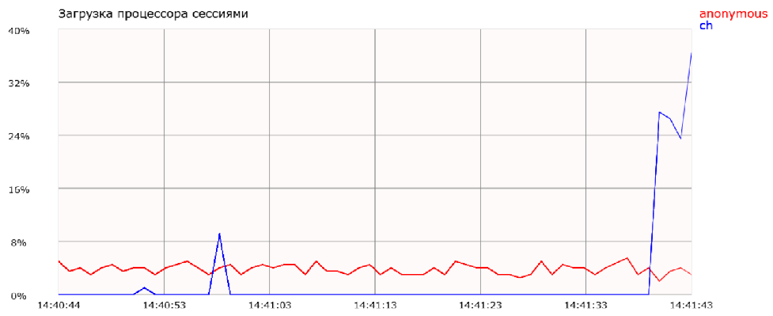

# Oracle_json_XML
Example of Oracle json and XML Web Services.

## Description

PL/SQL procedures `JSON_INFO.prc` `XML_INFO.prc` publish Oracle statistics `CPU used by this session` and `DB time` in json and XVL format.
Page `json_info.html` generates graph by js on `JSON_INFO.prc` data. 
Page `xml_info.html` generates table by js on `XML_INFO.prc` data.